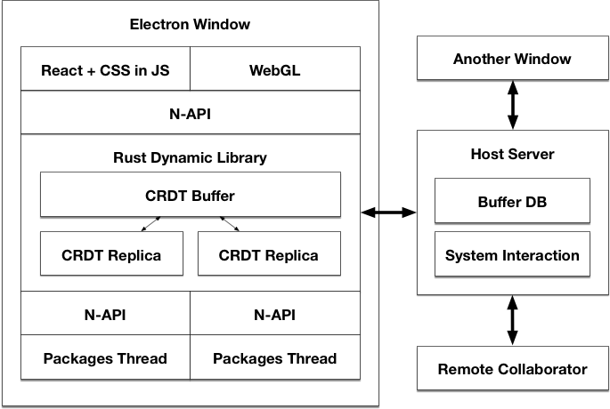
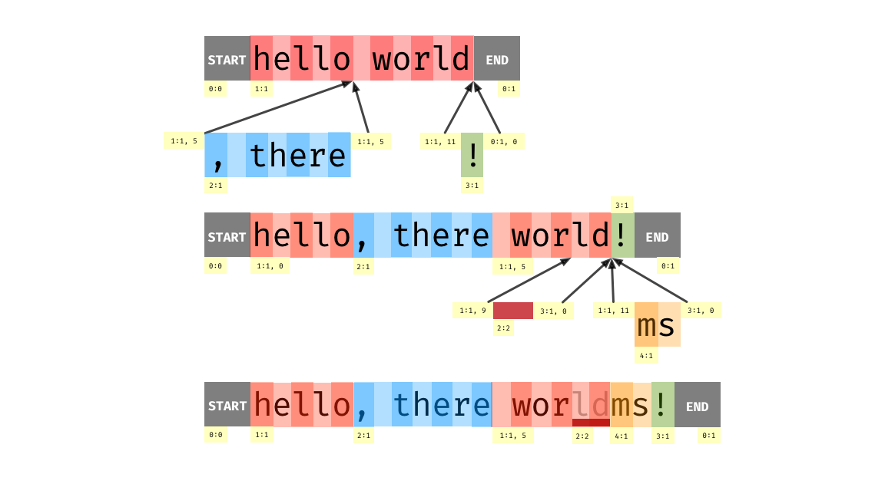

# Xray

[](https://travis-ci.org/atom/xray)

Xray is an experimental Electron-based text editor informed by what we've learned in the four years since the launch of Atom. In the short term, this project is a testbed for rapidly iterating on several radical ideas without risking the stability of Atom. The longer term future of the code in this repository will become clearer after a few months of progress. For now, our primary goal is to iterate rapidly and learn as much as possible.

## Updates

* [May 28, 2018](./docs/updates/2018_05_28.md)
* [May 14, 2018](./docs/updates/2018_05_14.md)
* [May 7, 2018](./docs/updates/2018_05_07.md)
* [April 30, 2018](./docs/updates/2018_04_30.md)
* [April 23, 2018](./docs/updates/2018_04_23.md)
* [Archives](./docs/updates/)

## Foundational priorities

Our goal is to build a cross-platform text editor that is designed from the beginning around the following foundational priorities:

### High performance

*Xray feels lightweight and responsive.*

We design our features to be responsive from the beginning. We reliably provide visual feedback within the latency windows suggested by the [RAIL performance model](https://developers.google.com/web/fundamentals/performance/rail). For all interactions, we shoot for the following targets on the hardware of our median user:

| Duration | Action |    
| - | - |
| 8ms | Scrolling, animations, and fine-grained interactions such as typing or cursor movement. |
| 50ms | Coarse-grained interactions such as opening a file or initiating a search. If we can't complete the action within this window, we should show a progress bar. |
| 150ms | Opening an application window. |

We are careful to maximize throughput of batch operations such as project-wide search. Memory consumption is kept within a low constant factor of the size of the project and open buffer set, but we trade memory for speed and extensibility so long as memory requirements are reasonable.

### Collaboration

*Xray makes it as easy to code together as it is to code alone.*

We design features for collaborative use from the beginning. Editors and other relevant UI elements are designed to be occupied by multiple users. Interactions with the file system and other resources such as subprocesses are abstracted to work over network connections.

### Extensibility

*Xray gives developers control over their own tools.*

We expose convenient and powerful APIs to enable users to add non-trivial functionality to the application. We balance the power of our APIs with the ability to ensure the responsiveness, stability, and security of the application as a whole. We avoid leaking implementation details and use versioning where possible to enable a sustained rapid development without destabilizing the package ecosystem.

### Web compatibility

*Editing on GitHub feels like editing in Xray.*

We want to provide a full-featured editor experience that can be used from within a browser. This will ultimately help us provide a more unified experience between GitHub.com and Xray and give us a stronger base of stakeholders in the core editing technology.

## Architecture

Martin Fowler defines software architecture as those decisions which are both important and hard to change. Since these decisions are hard to change, we need to be sure that our foundational priorities are well-served by these decisions.



### The UI is built with web technology

Web tech adds a lot of overhead, which detracts from our top priority of high-performance. However, web standards are also the best approach that we know of to deliver a cross-platform, extensible user interface. Atom proved that developers want to add non-trivial UI elements to their editor, and we still see web technologies as the most viable way to offer them that ability.

The fundamental question is whether we can gain the web's benefits for extensibility while still meeting our desired performance goals. Our hypothesis is that it's possible–with the right architecture.

### Core application logic is written in Rust

While the UI will be web-based, the core of the application is implemented in a server process written in Rust. We place as much logic as possible in a library crate located in `/xray_core`, then expose this logic as a server when running Xray on the desktop (`/xray_server`) and a web-assembly library running on a worker thread when running Xray in the browser (`/xray_wasm`). We communicate between the UI and the back end process via JSON RPC.

All of the core application code other than the view logic should be written in Rust. This will ensure that it has a minimal footprint to load and execute, and Rust's robust type system will help us maintain it more efficiently than dynamically typed code. A language that is fundamentally designed for multi-threading will also make it easier to exploit parallelism whenever the need arises, whereas JavaScript's single-threaded nature makes parallelism awkward and challenging.

Fundamentally, we want to spend our time writing in a language that is fast by default. It's true that it's possible to write slow Rust, and also possible to write fast JavaScript. It's *also* true that it's much harder to write slow Rust than it is to write slow JavaScript. By spending fewer resources on the implementation of the platform itself, we'll make more resources available to run package code.

### I/O will be centralized in the server

The server will serialize buffer loads and saves on a per-path basis, and maintains a persistent database of CRDT operations for each file. As edits are performed in windows, they will be streamed to the host process to be stored and echoed out to any other windows with the same open buffer. This will enable unsaved changes to always be incrementally preserved in case of a crash or power failure and preserves the history associated with a file indefinitely.

Early on, we should design the application process to be capable of connecting to multiple workspace servers to facilitate real-time collaboration or editing files on a remote server by running a headless host process. To support these use cases, all code paths that touch the file system or spawn subprocesses will occur in the server process. The UI will not make use of the I/O facilities provided by Electron, and instead interact with the server via RPC.

### Packages will run in a JavaScript VM in the server process

A misbehaving package should not be able to impact the responsiveness of the application. The best way to guarantee this while preserving ease of development is to activate packages on their own threads. We can run a worker thread per package or run packages in their own contexts across a pool of threads.

Packages *can* run code on the render thread by specifying versioned components in their `package.json`.

```json
"components": {
  "TodoList": "./components/todo-list.js"
}
```

If a package called `my-todos` had the above entry in its `package.json`, it could request that the workspace attach that component by referring to `myTodos.TodoList` when adding an item. During package installation on the desktop, we can automatically update the V8 snapshot of the UI to include the components of every installed package. Components will only be dynamically loaded from the provided paths in development mode.

Custom views will only have access to the DOM and an asynchronous channel to communicate with the package's back end running on the server. APIs for interacting with the core application state and the underlying operating system will only be available within the server process, discouraging package authors from putting too much logic into their views. We'll use a combination of asynchronous channels and CRDTs to present convenient APIs to package authors within worker threads.

### Text is stored in a copy-on-write CRDT

To fully exploit Rust's unique advantage of parallelism, we need to store text in a concurrency-friendly way. We use a variant of RGA called RGASplit, which is described in [this research paper](https://pages.lip6.fr/Marc.Shapiro/papers/rgasplit-group2016-11.pdf).



In RGA split, the document is stored as a sequence of insertion fragments. In the example above, the document starts as just a single insertion containing `hello world`. We then introduce `, there` and `!` as additional insertions, splitting the original insertion into two fragments. To delete the `ld` at the end of `world` in the third step, we create another fragment containing just the `ld` and mark it as deleted with a tombstone.

Structuring the document in this way has a number of advantages.

* Real-time collaboration works out of the box
* Concurrent edits: Any thread can read or write its own replica of the document without diverging in the presence of concurrent edits.
* Integrated non-linear history: To undo any group of operations, we increment an undo counter associated with any insertions and deletions that controls their visibility. This means we only need to store operation ids in the history rather than operations themselves, and we can undo any operation at any time rather than adhering to historical order.
* Stable logical positions: Instead of tracking the location of markers on every edit, we can refer to stable positions that are guaranteed to be valid for any future buffer state. For example, we can mark the positions of all search results in a background thread and continue to interpret them in a foreground thread if edits are performed in the meantime.

Our use of a CRDT is similar to the Xi editor, but the approach we're exploring is somewhat different. Our current understanding is that in Xi, the buffer is stored in a rope data structure, then a secondary layer is used to incorporate edits. In Xray, the fundamental storage structure of all text is itself a CRDT. It's similar to Xi's rope in that it uses a copy-on-write B-tree to index all inserted fragments, but it does not require any secondary system for incorporating edits.

### Derived state will be computed asynchronously

We should avoid implementing synchronous APIs that depend on open-ended computations of derived state. For example, when soft wrapping is enabled in Atom, we synchronously update a display index that maps display coordinates to buffer coordinates, which can block the UI.

In Xray, we want to avoid making these kinds of promises in our API. For example, we will allow the display index to be accessed synchronously after a buffer edit, but only provide an interpolated version of its state that can be produced in logarithmic time. This means it will be spatially consistent with the underlying buffer, but may contain lines that have not yet been soft-wrapped.

We can expose an asynchronous API that allows a package author to wait until the display layer is up to date with a specific version of the buffer. In the user interface, we can display a progress bar for any derived state updates that exceed 50ms, which may occur when the user pastes multiple megabytes of text into the editor.

### React will be used for presentation

By using React, we completely eliminate the view framework as a concern that we need to deal with and give package authors access to a tool they're likely to be familiar with. We also raise the level of abstraction above basic DOM APIs. The risk of using React is of course that it is not standardized and could have breaking API changes. To mitigate this risk, we will require packages to declare which version of React they depend on. We will attempt using this version information to provide shims to older versions of React when we upgrade the bundled version. When it's not possible to shim breaking changes, we'll use the version information to present a warning.

### Styling will be specified in JS

CSS is a widely-known and well-supported tool for styling user interfaces, which is why we embraced it in Atom. Unfortunately, the performance and maintainability of CSS degrade as the number of selectors increases. CSS also lacks good tools for exposing a versioned theming API and applying programmatic logic such as altering colors. Finally, the browser does not expose APIs for being notified when computed styles change, making it difficult to use CSS as a source of truth for complex components. For a theming system that performs well and scales, we need more direct control. We plan to use a CSS-in-JS approach that automatically generates atomic selectors so as to keep our total number of selectors minimal.

### Text is rendered via WebGL

In Atom, the vast majority of computation of any given frame is spent manipulating the DOM, recalculating styles, and performing layout. To achieve good text rendering performance, it is critical that we bypass this overhead and take direct control over rendering. Like Alacritty and Xi, we plan to employ OpenGL to position quads that are mapped to glyph bitmaps in a texture atlas.

There isn't always a 1:1 relationship between code units inside a JavaScript string and glyphs on screen. Characters (code points) can be expressed as two 16-bit units, but this situation is simple to detect by examining the numeric ranges of the code units. In other cases, the correspondence between code units and glyphs is less straightforward to determine. If the current font and/or locale depends on ligatures or contextual alternates to render correctly, determining the correspondence between code points and glyphs requires support for complex text shaping that references metadata embedded in the font. Bi-directional text complicates the situation further.

For now, our plan is to detect the presence of characters that may require such complex text shaping and fall back to rendering with HTML on the specific lines that require these features. This will enable us to support scripts such as Arabic and Devanagari. For fonts like FiraCode, which include ligatures for common character sequences used in programming, we'll need a different approach. One idea would be to perform a limited subset of text-shaping that just handles ligatures, so as to keep performance high. Another approach that would only work on the desktop would be to use the platform text-shaping and rasterization APIs in this environment.

Bypassing the DOM means that we'll need to implement styling and text layout ourselves. That is a high price to pay, but we think it will be worth it to bypass the performance overhead imposed by the DOM.

## Development process

### Experiment

At this phase, this code is focused on learning. Whatever code we write should be production-quality, but we don't need to support everything at this phase. We can defer features that don't contribute substantially to learning.

### Documentation-driven development

Before coding, we ask ourselves whether the code we're writing can be motivated by something that's written in the guide. The right approach here will always be a judgment call, but let's err on the side of transparency and see what happens.

### Disciplined monorepo

All code related to Xray should live in this repository, but intra-repository dependencies should be expressed in a disciplined way to ensure that a one-line docs change doesn't require us to rebuild the world. Builds should be finger-printed on a per-component basis and we should aim to keep components granular.

### Community SLA

Well-formulated PRs and issues will receive some form of response by the end of the next business day. If this interferes with our ability to learn, we'll revisit.

## Contributing

Interested in helping out? Welcome! Check out the [CONTRIBUTING](./CONTRIBUTING.md) guide to get started.

## Q1 2018 Roadmap

By May 1, we'd like it to be possible for multiple Xray clients to connect to a headless remote workspace. Clients should be able to open files from the remote project via the file finder and collaboratively edit shared buffers. We also would like to enable collaborators to follow each other around and have a text-based conversation in the workspace. We're going to focus on the bare minimum of editor features needed to reach this goal. If we're collaboratively editing text that isn't syntax highlighted, that's ok for now.

* [x] High-performance text rendering
* [x] Cursors, selections, and editing
* [x] Client/server architecture
* [x] File finder
* [x] Load and save buffers
* [x] Remote headless workspace
  * [x] File finder
  * [x] Loading a buffer
  * [x] Editing can be shared between multiple participants
  * [x] Saving
  * [x] Discussions
* [x] Flesh out basic editor experience
  * [x] Autoscroll
  * [x] Easy movement and editing operations

## Q2 2018

Once we get the basic collaboration experience down, we'll be looking to expand on it by adding the basic features that developers expect from a text editor. This list is incomplete and will likely evolve as this time approaches.

* [x] Key bindings system
* [x] Horizontal scrolling
* [ ] Word- and line-based cursor movements
  * [ ] Move To Beginning Of Line
  * [x] Move To Beginning Of Word
  * [ ] Move To Bottom
  * [ ] Move To End Of Line
  * [x] Move To End Of Word
  * [ ] Move To Top
  * [ ] Select To Beginning Of Line
  * [x] Select To Beginning Of Word
  * [ ] Select To Bottom
  * [ ] Select To End Of Line
  * [x] Select To End Of Word
  * [ ] Select To Top
* [x] Gutter with line numbers
* [ ] Mouse interaction
* [ ] Workspace tabs
* [ ] Split panes
* [ ] Undo history
* [ ] Syntax highlighting
* [ ] Diagnostics
* [ ] Autocomplete
* [ ] Symbolic navigation
* [ ] Find and replace in a buffer
* [ ] Local project-wide search
* [ ] Remote project-wide search
* [ ] Project browser
* [ ] Code folding
* [ ] Soft wrapping
* [ ] Clarify theming
* [ ] Following
* [ ] JS extensions
* [ ] Further optimize multi-cursor editing
