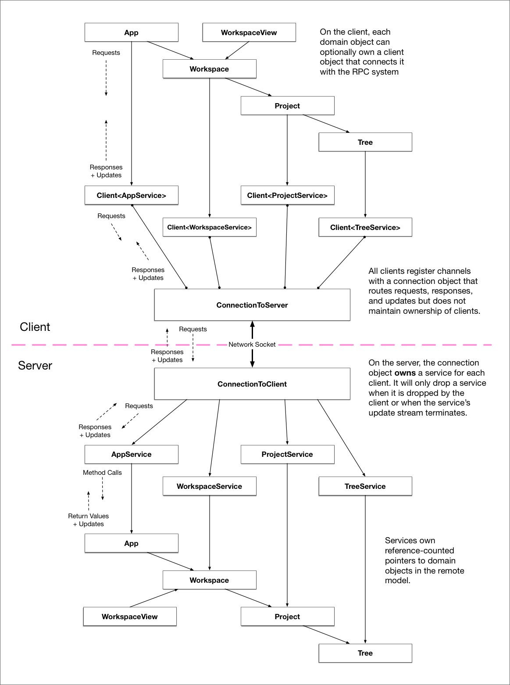

# Shared workspaces

## MVP

We want to host one or more workspaces on a remote server via a headless instance of Xray. Then we want to connect to the server from a client Xray instance and open one of these remote workspaces in a new window. Once open, we should be able to use the file finder to open buffers. A second client opening the same buffer should be able to make concurrent edits.

### Server

* `xray --headless foo/ bar/ --listen 8888` starts the Xray server listening on port 8888.

### Basic client experience

* `xray --connect hostname:port` opens a new window that is connected to the first workspace available on the remote host.
* `cmd-t` in the new window searches through paths in the remote workspace.
* Selecting a path opens it.
* Running `xray --connect` from a second instance allows for collaborative editing when clients open the same buffer.

### Selecting between multiple workspaces on the client

* If the host exposes multiple workspaces, `xray --connect hostname:port` opens an *Open Workspace* dialog that allows the user to select which workspace to open.
* `cmd-o` in any Xray window opens the *Open Workspace* dialog listing workspaces from all connected servers.

## RPC System

**This description is currently aspirational and describes work in progress.**

We implement shared workspaces on top of an RPC system that allows objects on the client to derive their state and behavior from objects that live on the server.

### Goals

#### Support replicated objects

The primary goal of the system is to support a the construction of a replicated object-oriented domain model. In addition to supporting remote procedure calls, we also want the system to explicitly support long-lived, stateful objects that change over time.

Replication support should be fairly additive, meaning that the domain model on the server side should be designed pretty much as if it weren't replicated. On the client side, interacting with representations of remote objects should be explicit but convenient.

#### Capabilities-based security

Secure ECMA Script and Cap'N Proto introduced me to the concept of capabilities-based security, and our system adopts the same philosophy. Objects on the server can be thought of as "capabilities" that grant access to a narrow slice of functionality that is dynamically defined. Starting from a single root capability, remote users are granted increasing access by being provided with additional capabilities.

#### Dynamic resource management

Ownership of the replication infrastructure on the server side should trace back to a client that depends on it. When a client discards a service, we should discard its supporting infrastructure on the server automatically.

#### Binary messages

We want to move data efficiently between the server and client, so a binary encoding scheme for messages is important. For now, we're using bincode for convenience, but we should eventually switch to Protobuf, Flatbuffers, Cap'N Proto, to support interaction between peers speaking different versions of the protocol.

### Design

**Services** are the fundamental abstraction of the system.

In `rpc::server`, `Service` is a *trait* which can be implemented by domain objects (or custom service wrappers for domain objects) to make them accessible to remote clients. A `Service` exposes a static snapshot of the object's initial state, a stream of updates, and the ability to handle requests. The `Service` trait has various associated types for `Request`, `Response`, `Update`, and `State`.

When server side code accepts connections, it creates an `rpc::server::Connection` object for each client that takes ownership of the `Stream` of that client's incoming messages. `Connection`s must be created with a *root service*, which is always sent to the client when they initially connect. The `Connection` is itself a `Stream` of outgoing messages to be sent to the `Sink` of its client.

On the client side, we create a connection by passing the `Stream` of incoming messages to `rpc::client::Connection::new`, which returns a *future* for a tuple containing two objects. The first object is a `rpc::client::Service` representing the *root service* that was automatically sent from the server. The second is an instance of `client::Connection`, which is a `Stream` of outgoing messages to send to the `Sink` of the server.

Using the root service, the client can make requests to gain access to additional services. In Xray, the root service is currently `App`, which includes a list of shared workspaces in its replicated state. We store the remote service handle in a `PeerList` object that is owned by the local `App` instance, which is the backing model for a `PeerList` view that lists all the connected peers along with descriptions of the workspaces they are currently sharing.

When the user selects a workspace, we request a `Workspace` service from the server via its id. When handling the request on the server, we call `add_service` on the connection with the requested workspace, which returns us a `ServiceId` integer. We send that id to the client in the response. When handling the response on the client, we call `get_service` on root service with the id to take ownership of the remote service's handle.

We can then create a `RemoteWorkspace` and pass it ownership of the handle to the remote workspace. `RemoteWorkspace` and `LocalWorkspace` both implement the `Workspace` trait, which allows a `RemoteWorkspace` to be used in the system in all of the same ways that a `LocalWorkspace` can.

We create the illusion that remote domain objects are really local through a combination of state replication and remote procedure calls. Fuzzy finding on the project file trees is addressed through replication, since the data size is typically small and the task is latency sensitive. Project-wide search is implemented via RPC, since replicating the contents of the entire remote file system would be costly, especially for the in-browser use case.
