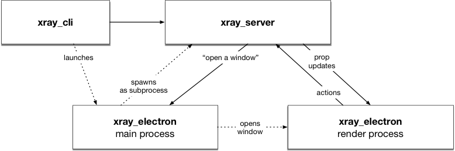
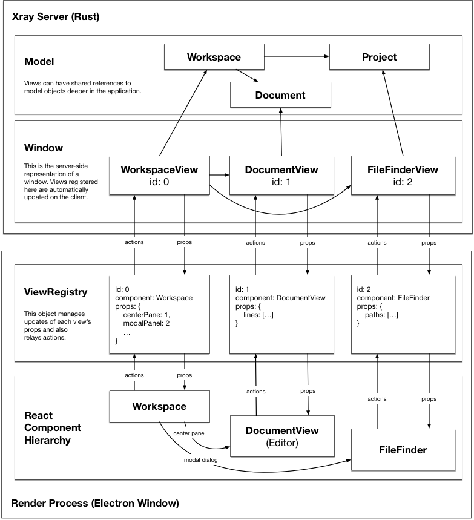

# Xray's client/server protocol

Xray is organized around a client/server architecture, with all the application logic centralized in a central server. User-facing components connect to this server as clients to present the user experience.

## Major application components

All application logic is controlled by a single server that listens on a domain socket located at `ATOM_SOCKET_PATH`. We connect to the server with three different types of clients:

* **CLI:** When you run the `xray` binary, we will check if a socket for the server already exists. If it does, we will connect to this socket and communicate with the server directly. For example, the application may already be running, but we want to open a new workspace for a given path. To do that, we just connect to the existing socket and send it an `OpenWorkspace` message.
* **App:** The Electron app in `xray_electron` connects to the server as an app client. If no socket exists when launching via the CLI, we launch the `xray_electron`, then spawn the server as a subprocess of the Electron main process and wait for it to start listening on the socket. We then connect to the server via the socket and identify ourselves as the application via a `{type: StartApp}` message. After that we forward the initial message assigned to `XRAY_INITIAL_MESSAGE` environment variable. One message that the server sends to the app client is the `OpenWindow` message, which tells the app to open a new window.
* **Window:** When the server tells the app to open a window, it provides a window id, which gets passed to the Electron window in the URL. Once the window loads, it connects to the server's socket and identifies itself as a window, supplying this id.

## The window protocol

The protocol between the window and the server in inspired by the [Flux application architecture](https://facebook.github.io/flux/), though it's probably different in some ways due to the particular needs of Xray.

The state of the UI for any given window is managed entirely by the server. It creates a `Window` object for each connected window, and this `Window` object is responsible for managing a tree of views to be rendered by the connected client. Each view is associated with a unique identifier, a component name, and a plain-old JS object representing the view's state. Views can refer to *other* views via their id.

When views are added and removed from the `Window` object on the server side, updates are automatically relayed to the client. The server calls `render()` on any newly added views to obtain a JSON object representing the view's state. The window also observes an `updates()` stream associated with each view, and sends a new update for a view's state if the view becomes dirty. To keep things simple, each time a view is updated, its entire state tree is sent again across the wire. For this reason, it's important to limit the size of each view's state object to avoid transmission and parsing overhead. Since the required data for a given view is naturally limited by the viewport, this should be acceptable.

The root view is always a `WorkspaceView` with an id of `0`. Its props refer to other views that are displayed in the workspace via their id. For example, the workspace may contain a `DocumentView` (editor) with id 1, and also be presenting a `FileFinderView` with id 2 as a modal panel. When views are added to the `Window`, they are provided with a `WindowHandle` that allows them to add additional sub-views to the window. When a view adds a sub-view, it receives a `ViewHandle`. When this handle is dropped, the sub-view is automatically removed from the `Window` and deleted on the client.

In the render process, we maintain a `ViewRegistry` which mirrors the state of the `Window` in the server process. The `ViewRegistry` contains an imperative interface for fetching the component and props associated with a particular view id, although most code will interface with the registry declaratively via special React components.

The render process communicates changes to the server via *actions*, which are plain-old JS objects that can be dispatched to a particular view id. These actions are dispatched from the `ViewRegistry` on the render process and make their way to the server, where they are routed by the `Window` object. `Window` calls `dispatch_action` on the view corresponding to the action's specified `view_id`, passing the JSON to the view for handling.

Views can handle an action by updating their own state or the state of other model objects. The `Window` detects state changes via the `updates` stream of any current views, then sends these updates to the client.

## Detecting when views need to be re-rendered

Each view is associated with an `updates` stream, which is implemented with the Rust [`futures`](https://docs.rs/futures/0.2.0-alpha/futures/) crate. A full explanation of Rust futures is beyond the scope of this document, but their poll-oriented nature is relevant to this use case.

The `Window` object represents the messages that need to be sent to the client as a `Stream` called `WindowUpdateStream`. This stream implements `poll`, which checks dirty sets for inserted and removed views, then calls `poll` on the updates stream of all currently-visible views. Any views returning `Async::Ready` are then rendered and added to the next update to be sent to the client.

If polling every visible view on each poll of the window update stream turns out to have too much overhead, we can always employ a similar strategy to the `FuturesUnordered` object and track notifications in a more fine-grained way. However, since we're anticipating rendering far fewer than 100 discrete views at any one time, we don't think polling everything should be an issue.

One cool feature of the stream-oriented approach for detecting individual view updates is that a given view's update stream could be composed from other streams in fairly complex ways. For example, the updates stream of a `DocumentView` (editor) could derive from a `NotifyCell` on the view itself, plus an updates stream on the view's `Document`, which it could share with other `DocumentView`s.

## Declarative interface on the client

**This is still a work in progress.**

We want to make it easy to consume updates from the server on the client, so we plan to thread the view registry through the component tree using React's [context](https://reactjs.org/docs/context.html) feature.

The view registry will be accessed by a special `View` component, which is passed the relevant view id as a property. The `View` component will automatically retrieve the appropriate component class and props for the view with the given id from the view registry, then render the view. It will subscribe to state updates and re-render the child component as needed. It will also pass a `dispatch` property to the child component, enabling actions to be dispatched to the view's back-end representation.